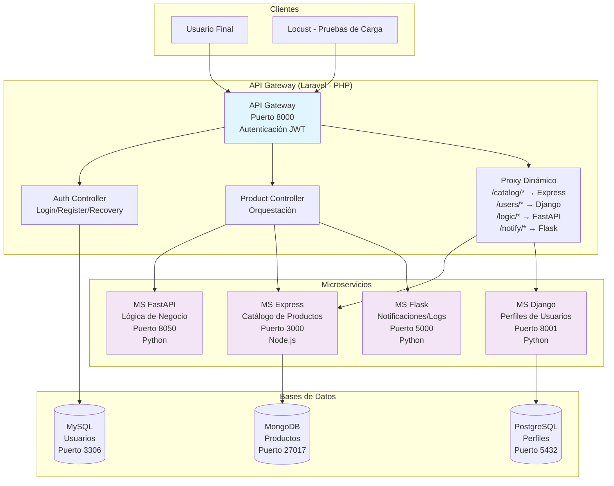

# ProyectoSoft2
Santiago Fernández Gaona - 1109920531

## Descripción del Proyecto

Este proyecto implementa una arquitectura de microservicios para un sistema de gestión de productos y usuarios. Consiste en 5 microservicios independientes:

- **API Gateway (Laravel)**: Punto de entrada principal, maneja autenticación, orquestación y proxy a otros servicios.
- **MS Express (Node.js)**: Servicio de catálogo de productos, utiliza MongoDB.
- **MS Django (Python)**: Servicio de perfiles de usuarios, utiliza PostgreSQL.
- **MS FastAPI (Python)**: Servicio de lógica de negocio, calcula impuestos.
- **MS Flask (Python)**: Servicio de notificaciones y logging.

La arquitectura utiliza comunicación síncrona entre servicios, con validaciones de seguridad y trazabilidad en cada paso.

## Arquitectura del Sistema



### Flujo de Comunicación

1. **Autenticación**: Usuario → API Gateway → MySQL
2. **Creación de Producto (Orquestado)**: 
   - API Gateway → FastAPI (calcular IVA) → API Gateway
   - API Gateway → Express (guardar producto) → MongoDB
   - API Gateway → Flask (registrar log)
3. **Consulta de Catálogo**: Usuario → API Gateway → Express → MongoDB
4. **Perfil de Usuario**: Usuario → API Gateway → Django → PostgreSQL
5. **Notificaciones**: Todos los servicios → Flask (logs de auditoría)

### Tecnologías Utilizadas

- **Lenguajes**: PHP (Laravel), JavaScript (Node.js), Python (Django, FastAPI, Flask)
- **Bases de Datos**: MySQL, MongoDB, PostgreSQL
- **Autenticación**: JWT con Laravel Sanctum
- **Comunicación**: HTTP/JSON síncrona
- **Pruebas**: Locust para carga y estrés

## Arquitectura del Sistema


### Flujo de Comunicación

1. **Autenticación**: Usuario → API Gateway → MySQL
2. **Creación de Producto (Orquestado)**: 
   - API Gateway → FastAPI (calcular IVA) → API Gateway
   - API Gateway → Express (guardar producto) → MongoDB
   - API Gateway → Flask (registrar log)
3. **Consulta de Catálogo**: Usuario → API Gateway → Express → MongoDB
4. **Perfil de Usuario**: Usuario → API Gateway → Django → PostgreSQL
5. **Notificaciones**: Todos los servicios → Flask (logs de auditoría)

### Tecnologías Utilizadas

- **Lenguajes**: PHP (Laravel), JavaScript (Node.js), Python (Django, FastAPI, Flask)
- **Bases de Datos**: MySQL, MongoDB, PostgreSQL
- **Autenticación**: JWT con Laravel Sanctum
- **Comunicación**: HTTP/JSON síncrona
- **Pruebas**: Locust para carga y estrés

## Documentación de Endpoints

### API Gateway (Laravel - Puerto 8000)

#### Endpoints Públicos (No requieren autenticación)

- **POST /api/register**
  - Descripción: Registra un nuevo usuario en el sistema.
  - Parámetros (JSON):
    - `name` (string, requerido): Nombre del usuario.
    - `email` (string, requerido, único): Correo electrónico.
    - `password` (string, requerido, min 8 caracteres): Contraseña.
    - `password_confirmation` (string, requerido): Confirmación de contraseña.
    - `security_question` (string, requerido): Pregunta de seguridad.
    - `security_answer` (string, requerido): Respuesta de seguridad.
  - Respuesta exitosa (201):
    ```json
    {
      "message": "Usuario registrado e iniciado con éxito",
      "access_token": "token_jwt",
      "token_type": "Bearer",
      "user": { ... }
    }
    ```

- **POST /api/login**
  - Descripción: Inicia sesión de un usuario existente.
  - Parámetros (JSON):
    - `email` (string, requerido): Correo electrónico.
    - `password` (string, requerido): Contraseña.
  - Respuesta exitosa (200):
    ```json
    {
      "message": "Logeo exitoso",
      "token": "token_jwt",
      "user": { "name": "...", "email": "..." }
    }
    ```

- **POST /api/recovery**
  - Descripción: Recupera la contraseña usando pregunta de seguridad.
  - Parámetros (JSON):
    - `email` (string, requerido): Correo electrónico.
    - `security_answer` (string, requerido): Respuesta de seguridad.
    - `new_password` (string, requerido, min 8): Nueva contraseña.
    - `new_password_confirmation` (string, requerido): Confirmación.
  - Respuesta exitosa (200):
    ```json
    {
      "message": "Contraseña actualizada y sesión iniciada",
      "access_token": "token_jwt",
      "token_type": "Bearer",
      "user": "..."
    }
    ```

#### Endpoints Protegidos (Requieren Bearer Token en header Authorization)

- **POST /api/logout**
  - Descripción: Cierra la sesión del usuario actual.
  - Headers: `Authorization: Bearer {token}`
  - Respuesta exitosa (200):
    ```json
    {
      "message": "Sesión cerrada exitosamente. El token ha sido eliminado."
    }
    ```

- **POST /api/products**
  - Descripción: Crea un producto con orquestación completa (Laravel → FastAPI → Express → Flask).
  - Headers: `Authorization: Bearer {token}`
  - Parámetros (JSON):
    - `name` (string, requerido): Nombre del producto.
    - `price` (number, requerido): Precio base.
    - `description` (string, requerido): Descripción.
    - `stock` (integer, requerido): Cantidad en stock.
    - `category` (string, requerido): Categoría.
    - `user_id` (integer, requerido): ID del usuario creador.
  - Respuesta exitosa (201):
    ```json
    {
      "message": "Flujo completado exitosamente",
      "final_product": { ... }
    }
    ```

- **GET /api/catalog/products**
  - Descripción: Lista todos los productos (proxy a MS Express).
  - Headers: `Authorization: Bearer {token}`
  - Respuesta exitosa (200): Array de productos.

- **POST /api/catalog/products**
  - Descripción: Crea un producto directamente (proxy a MS Express).
  - Headers: `Authorization: Bearer {token}`
  - Parámetros: Mismos que /api/products.
  - Respuesta exitosa (201): Producto creado.

- **GET /api/users/profile/{user_id}**
  - Descripción: Obtiene perfil detallado de usuario (proxy a MS Django).
  - Headers: `Authorization: Bearer {token}`
  - Parámetros URL: `user_id` (integer).
  - Respuesta exitosa (200): Datos del perfil.

### MS Express (Node.js - Puerto 3000)

- **GET /api/catalog/products**
  - Descripción: Lista todos los productos almacenados en MongoDB.
  - Respuesta (200): Array de productos.

- **POST /api/catalog/products**
  - Descripción: Crea un nuevo producto en MongoDB.
  - Parámetros (JSON): `name`, `description`, `price`, `stock`, `category`, `user_id`.
  - Respuesta (201): Producto creado con `_id` de MongoDB.

### MS Django (Python - Puerto 8001)

- **GET /api/users/profile/{user_id}**
  - Descripción: Obtiene información detallada del perfil de usuario desde PostgreSQL.
  - Parámetros URL: `user_id` (integer).
  - Respuesta (200): Datos del perfil del usuario.

### MS FastAPI (Python - Puerto 8050)

- **POST /api/logic/calculate-tax**
  - Descripción: Calcula el precio con IVA del 19%.
  - Parámetros (JSON):
    - `price` (float, requerido): Precio base.
  - Respuesta (200):
    ```json
    {
      "total_price": 119.0
    }
    ```

## Instrucciones de Despliegue Inicial

### Requisitos Previos

- **PHP 8.1+** con Composer
- **Node.js 16+** con npm
- **Python 3.9+** con pip
- **MySQL 8.0+**
- **MongoDB 5.0+**
- **PostgreSQL 13+**
- **Git**

### Paso 1: Clonar el Repositorio

```bash
git clone <url_del_repositorio>
cd ProyectoSoft2
```

### Paso 2: Configurar Base de Datos

1. **MySQL** (para API Gateway):
   - Crear base de datos: `proyectosoft`
   - Usuario: `root`, contraseña: (vacía o configurar)

2. **MongoDB** (para MS Express):
   - Crear base de datos: `proyecto`
   - Ejecutar MongoDB en puerto 27017

3. **PostgreSQL** (para MS Django):
   - Crear base de datos: `proyecto_soft`
   - Usuario: `postgres`, contraseña: `password`

### Paso 3: Desplegar API Gateway (Laravel)

```bash
cd api-gateway

# Instalar dependencias
composer install

# Copiar archivo de configuración
cp .env.example .env

# Configurar .env (editar con tus datos de BD)
# DB_CONNECTION=mysql
# DB_HOST=127.0.0.1
# DB_PORT=3306
# DB_DATABASE=proyectosoft
# DB_USERNAME=root
# DB_PASSWORD=

# MS_USERS_URL=http://localhost:8001/api
# MS_CATALOG_URL=http://localhost:3000/api
# MS_LOGIC_URL=http://localhost:8050/api
# MS_NOTIFY_URL=http://localhost:5000

# Generar clave de aplicación
php artisan key:generate

# Ejecutar migraciones
php artisan migrate

# Iniciar servidor
php artisan serve 


### Paso 4: Desplegar MS Express (Node.js)

```bash
cd ../ms_express

# Instalar dependencias
npm install

# Iniciar servidor
node index.js
```
El servidor se ejecutará en http://localhost:3000

### Paso 5: Desplegar MS Django (Python)

```bash
cd ../ms_django

# Instalar dependencias
pip install -r requirements.txt

# Configurar base de datos (editar settings.py)
DATABASES = {
    'default': {
        'ENGINE': 'django.db.backends.postgresql',
        'NAME': 'proyecto_soft',
        'USER': 'postgres',
        'PASSWORD': 'password',
        'HOST': 'localhost',
        'PORT': '5432',
    }
}

# Ejecutar migraciones
python manage.py migrate

# Iniciar servidor
python manage.py runserver 8001
```

### Paso 6: Desplegar MS FastAPI (Python)

```bash
cd ../ms_fastapi

# Instalar dependencias
pip install fastapi uvicorn

# Iniciar servidor
uvicorn main:app --host 0.0.0.0 --port 8050
```

### Paso 7: Desplegar MS Flask (Python)

```bash
cd ../ms_flask

# Instalar dependencias
pip install flask flask-cors

# Iniciar servidor
python app.py
```
El servidor se ejecutará en http://localhost:5000

### Paso 8: Verificar Despliegue

1. Acceder a http://localhost:8000 para verificar API Gateway
2. Probar endpoints con herramientas como Postman o Thunder Client
3. Ejecutar pruebas de Locust: `locust -f locustfile.py`


# Resultados de las Pruebas de Rendimiento de Locust

Type     Name           # reqs      # fails |    Avg     Min     Max    Med |   req/s  failures/s
--------|-------------|-------|-------------|-------|-------|-------|-------|--------|-----------
GET      /api/catalog/products     259     0(0.00%) |  15152    4821   42620  13000 |    0.57        0.00
POST     /api/catalog/products     145     0(0.00%) |  15813    6070   44871  13000 |    0.32        0.00
POST     /api/login         80     0(0.00%) |  21908     661   43199  22000 |    0.18        0.00
POST     /api/logout        75     0(0.00%) |  16569    8476   45345  14000 |    0.17        0.00
POST     /api/recovery     341     0(0.00%) |  25891   11494   66100  26000 |    0.75        0.00
POST     /api/register     328     0(0.00%) |  13663    5160   42152  13000 |    0.72        0.00
GET      /api/users/profile/2     128     0(0.00%) |  15471    6362   45680  14000 |    0.28        0.00
--------|-------------|-------|-------------|-------|-------|-------|-------|--------|-----------
         Aggregated       1356     0(0.00%) |  18070     661   66100  15000 |    2.99        0.00

Response time percentiles (approximated)
Type     Name                   50%    66%    75%    80%    90%    95%    98%    99%  99.9% 99.99%   100% # reqs
--------|-----------------|--------|------|------|------|------|------|------|------|------|------|------|------
GET      /api/catalog/products    13000  14000  15000  16000  21000  38000  42000  42000  43000  43000  43000    259
POST     /api/catalog/products    13000  15000  17000  18000  26000  37000  43000  44000  45000  45000  45000    145
POST     /api/login           22000  28000  33000  35000  39000  42000  43000  43000  43000  43000  43000     80
POST     /api/logout          14000  15000  17000  20000  29000  40000  41000  45000  45000  45000  45000     75
POST     /api/recovery        26000  27000  28000  29000  31000  33000  42000  48000  66000  66000  66000    341
POST     /api/register        13000  14000  15000  16000  17000  18000  22000  25000  42000  42000  42000    328
GET      /api/users/profile/2    14000  15000  17000  18000  22000  29000  43000  44000  46000  46000  46000    128
--------|-----------------|--------|------|------|------|------|------|------|------|------|------|------|------
         Aggregated           15000  20000  24000  25000  29000  34000  41000  43000  64000  66000  66000   1356

# Reporte Detallado de Pruebas de Rendimiento

Se realizaron pruebas de carga, capacidad y estrés para evaluar la respuesta de la arquitectura de microservicios bajo condiciones de alta concurrencia.

1. Configuración del Escenario
- Usuarios Concurrentes: 80 usuarios.

- Tasa de Arranque (Ramp-up): 40 usuarios/segundo (Carga agresiva).

- Duración: Prueba sostenida con 1,356 peticiones totales realizadas.

- Tasa de Éxito: 100% (0 fallos detectados).

2. Análisis de Resultados por Tipo de Prueba

*A. Prueba de Carga*

Bajo un flujo constante de 80 usuarios, el sistema mantuvo un RPS (Peticiones por Segundo) promedio de 2.99, con picos de hasta 6 RPS.

- Observación: La gráfica de solicitudes por segundo mostró estabilidad total; el API Gateway gestionó el tráfico sin rechazar ninguna conexión.

*B. Prueba de Capacidad*

Se analizó el tiempo que tarda el sistema en responder cuando todos los servicios están interactuando.

- Tiempo Promedio: 18,070 ms (18 segundos).

- Mediana: 15,000 ms (15 segundos).

- Conclusión: El sistema es capaz de procesar toda la carga, pero el tiempo de respuesta de 15s marca el límite de capacidad del hardware local. Esto se debe a la orquestación síncrona entre los 5 microservicios (Laravel → FastAPI → Express → Flask).

*C. Prueba de Estrés*

Se evaluó el comportamiento durante el arranque súbito de 40 usuarios por segundo.

- Comportamiento: Se detectó un pico máximo de latencia de 66,100 ms (66.1 segundos) en la ruta de recuperación de contraseña (/api/recovery).

- Conclusión: El sistema demostró una alta resiliencia. A pesar del estrés extremo en el arranque, la línea de fallos permaneció en 0, lo que indica que los servicios encolan las peticiones correctamente en lugar de colapsar.

*Tabla de Métricas por Endpoint*

Método - Endpoint     -      Peticiones - Mínimo (ms) - Promedio (ms) - Máximo (ms)
GET - /api/catalog/products -  259      - 4,821       - 15,152        - 42,620
POST - /api/catalog/products - 145      - 6,070       - 15,813        - 44,871
POST - /api/login          -   80       - 661         - 21,908        - 43,199
POST - /api/recovery       -   341      - 11,494      - 25,891        - 66,100
POST - /api/register       -   328      - 5,160       - 13,663        - 42,152
GET - /api/users/profile/2 -   128      - 6,362       - 15,471        - 45,680

*Conclusiones Técnicas*
- Fiabilidad: La arquitectura es 100% fiable bajo carga; no se perdieron datos ni se cayeron contenedores/servicios durante las pruebas.

- Cuello de Botella: La latencia acumulada (promedio de 18s) es el resultado de la comunicación síncrona entre múltiples servicios corriendo en un mismo entorno local.

- Eficiencia de Rutas: El login es la operación más rápida en responder inicialmente (661ms), mientras que los procesos que requieren orquestación completa (Recovery y Catalog) presentan la mayor carga de procesamiento.